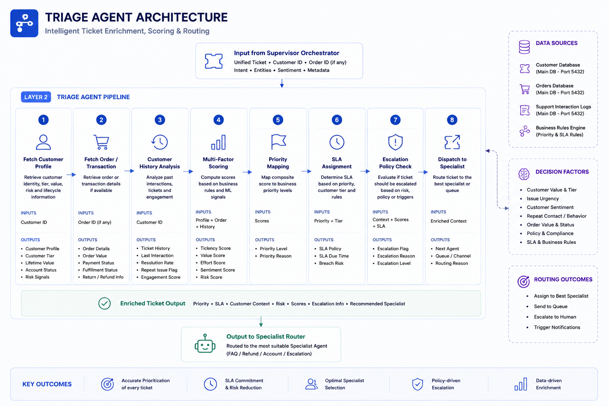
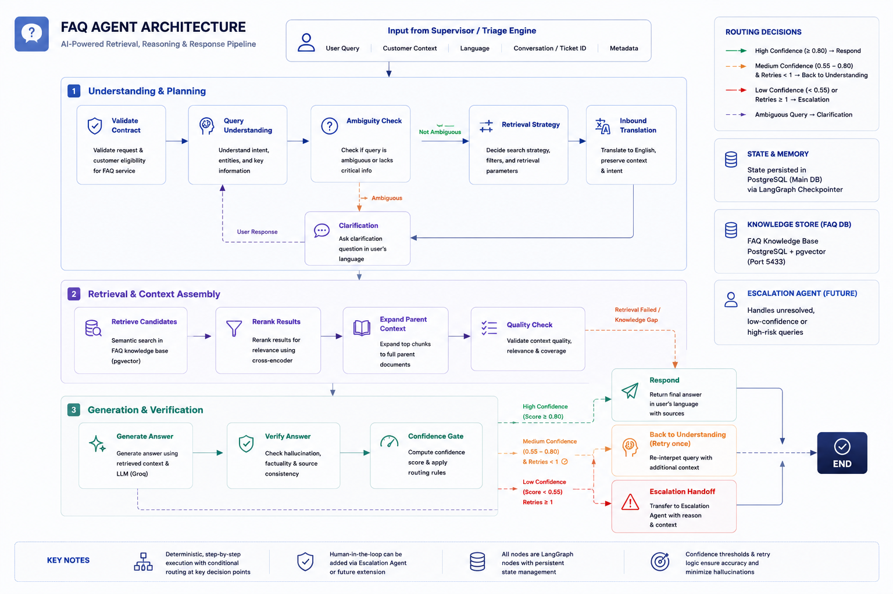
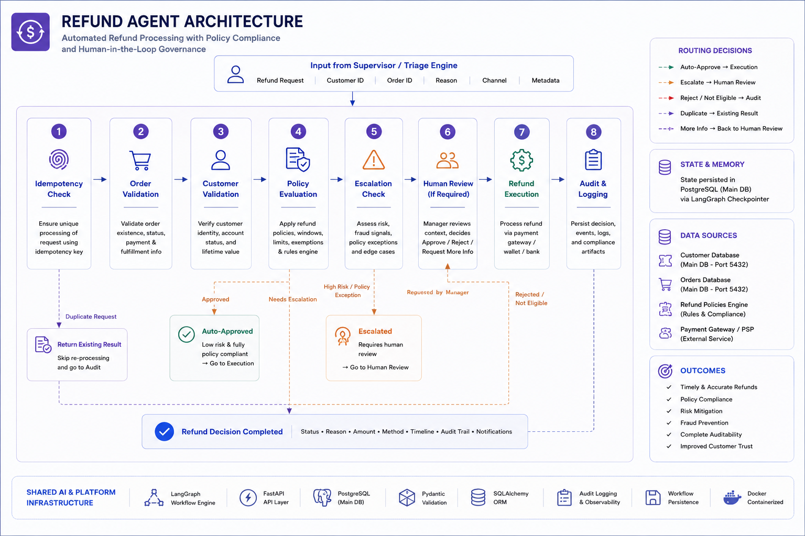
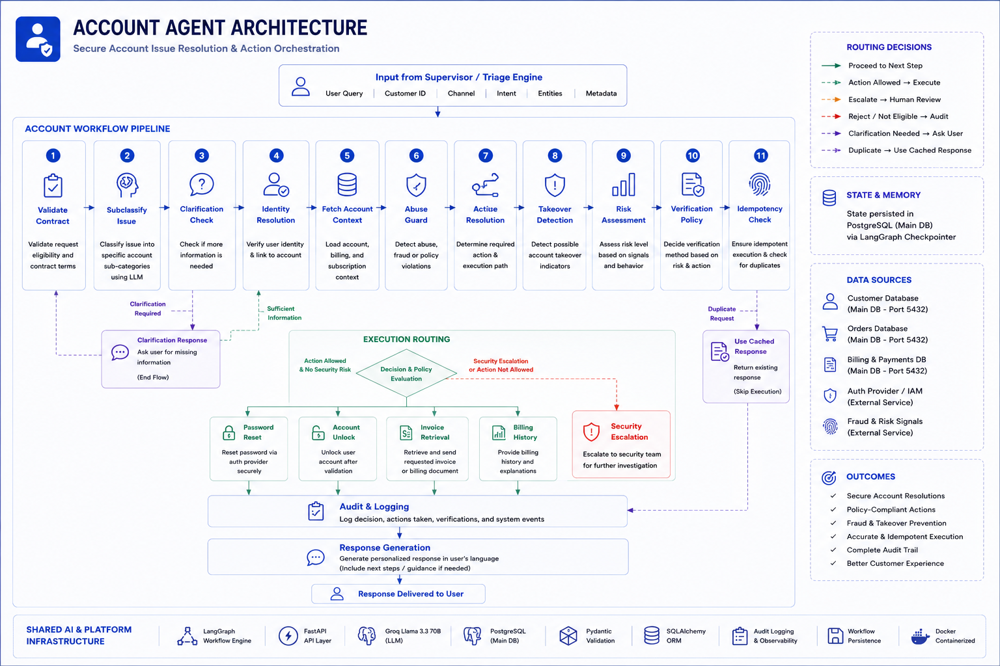
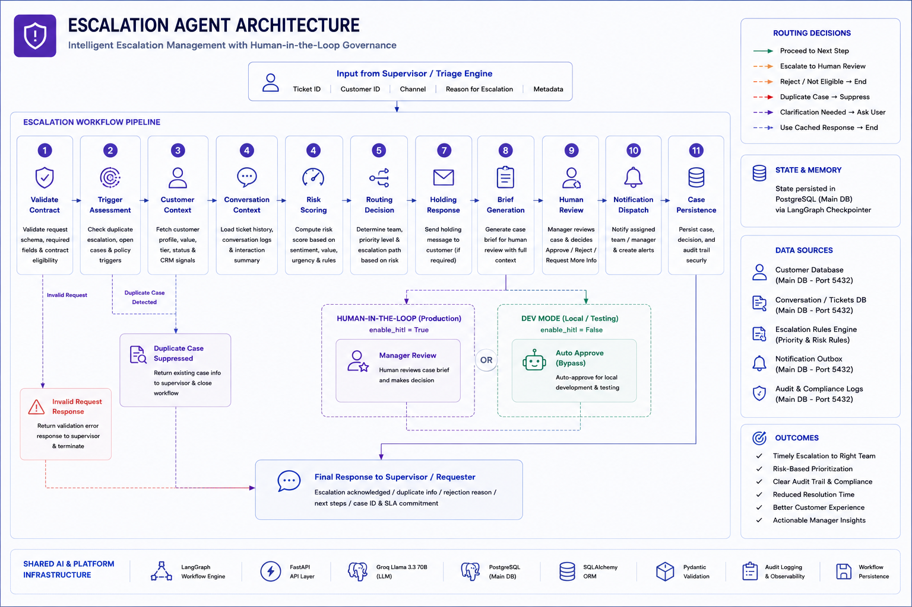

<div align="center">

# 🚀 Enterprise AI-Powered Multi-Agent Customer Support Platform

### Production-Ready Enterprise Customer Support Automation powered by LangGraph, FastAPI, Groq Llama 3.3, PostgreSQL and Intelligent Multi-Agent Orchestration

<p align="center">


</p>

---

### 🌐 Live Demo

**Frontend:** https://crm-agent-tau.vercel.app/

**Repository:** https://github.com/shiwan-mangate/Multi-AI-Agents-Customer-Support-Automation-System

---

*An enterprise-grade multilingual customer support platform that combines AI orchestration, specialized autonomous agents, human-in-the-loop governance, CRM intelligence, and proactive customer engagement into a single production-ready architecture.*

</div>

---

# 📖 Platform Overview

Modern customer support platforms must do more than simply answer user queries. Enterprise organizations require intelligent orchestration, multilingual communication, business-aware decision making, workflow governance, customer analytics, and proactive engagement—all while maintaining reliability, auditability, and scalability.

This project presents a **production-ready enterprise AI platform** that automates the complete customer support lifecycle using a layered multi-agent architecture.

Instead of relying on a single LLM to answer every request, the platform decomposes customer interactions into specialized workflows. Each incoming request is analyzed, enriched, prioritized, routed to a domain-specific AI agent, translated when necessary, persisted for auditability, and synchronized with CRM intelligence before finally delivering a personalized response to the customer.

Unlike conventional chatbot implementations, the platform introduces:

- Intelligent AI orchestration using LangGraph
- Specialized domain agents with isolated workflows
- Human-in-the-Loop (HITL) approval for sensitive operations
- Multilingual inbound and outbound translation
- Persistent workflow execution using PostgreSQL checkpointers
- CRM intelligence and customer lifecycle management
- Autonomous proactive customer engagement
- Analytics-driven business insights

The result is a scalable architecture capable of supporting enterprise-grade customer operations while maintaining transparency, modularity, and operational governance.

---

# ✨ Platform Highlights

| Capability | Description |
|------------|-------------|
| 🤖 Multi-Agent Architecture | Independent specialist AI agents for FAQ, Refund, Account Management, Escalation, CRM Intelligence, and Proactive Engagement |
| 🧠 LangGraph Orchestration | Durable stateful workflows with checkpointing and resumable execution |
| 🌍 Multilingual Support | Automatic language detection, translation, localization, and response generation |
| 🎯 Intelligent Routing | AI Supervisor and Triage Engine determine the optimal specialist for every customer request |
| 👨‍💼 Human-in-the-Loop | Manager approval workflows for high-risk or policy-sensitive operations |
| 📊 CRM Intelligence | Customer profiling, analytics, event processing, feedback management, and churn monitoring |
| 🚀 Proactive AI | Autonomous background agent that detects churn risk and customer inactivity every 60 seconds |
| 💾 Persistent Workflows | PostgreSQL-backed workflow persistence with resumable execution |
| 🔍 Enterprise Observability | Audit logging, workflow tracking, customer timelines, and translation analytics |
| 🐳 Production Deployment | Containerized using Docker and deployed on Hugging Face Spaces |

---

# ⚡ Key Features

## Enterprise AI Orchestration

- AI Supervisor for intent classification
- Confidence-based intelligent routing
- Business-aware triage engine
- Durable workflow execution
- Shared dependency injection architecture

---

## Specialized AI Agents

- 📚 FAQ Agent (Retrieval-Augmented Generation)
- 💰 Refund Agent
- 🔐 Account Management Agent
- 🚨 Escalation Agent
- 📈 CRM Intelligence Agent
- 🤖 Proactive Customer Engagement Agent

---

## Human Governance

- LangGraph Interrupt-based approval workflow
- Manager review queue
- Workflow persistence
- Resume from checkpoint
- Audit logging

---

## Translation Intelligence

- Automatic language detection
- Native language response generation
- Translation validation
- Translation memory cache
- Entity protection
- Multilingual customer conversations

---

## CRM Intelligence

- Customer profile management
- Customer timeline generation
- Interaction history
- Feedback processing
- Customer analytics
- Churn score updates
- Event-driven CRM synchronization

---

## Proactive Customer Success

- Automatic CRM scanning
- Customer inactivity detection
- Churn prediction
- Risk assessment
- Automated outreach
- Escalation handoff

---

## Analytics Platform

- Agent performance analytics
- Language analytics
- Customer satisfaction metrics
- Intent analytics
- Knowledge gap detection
- Churn monitoring
- Executive dashboard generation

---

# 🏗️ Enterprise System Architecture

<div align="center">


</div>

---

# 🔄 High-Level Request Flow

Every customer interaction passes through a layered enterprise workflow designed to maximize automation while maintaining business governance.

```
Customer
        │
        ▼
API Gateway (FastAPI)
        │
        ▼
Layer 0
Input Processing
        │
        ▼
Inbound Translation Pipeline
        │
        ▼
Layer 1
AI Supervisor
        │
        ▼
Layer 2
Intelligent Triage
        │
        ▼
Specialist Agent
        │
        ▼
Human Approval (If Required)
        │
        ▼
Outbound Translation
        │
        ├────────────► Customer
        │
        ▼
CRM Intelligence
```

Meanwhile, a completely independent background pipeline continuously monitors customer behavior.

```
CRM Intelligence
        │
        ▼
Customer Profiles
        │
        ▼
Signal Detection
        │
        ▼
Proactive Agent
        │
        ├────────► Customer Outreach
        │
        ▼
Escalation Agent
```

---

# 🧩 High-Level Architecture

The platform follows a layered enterprise architecture where every layer owns a single business responsibility.

### Layer 0 — Input Processing & Language Intelligence

Receives customer requests, normalizes incoming payloads, enriches customer context, detects the customer's language, performs translation when necessary, and generates a unified ticket contract for downstream AI workflows.

---

### Layer 1 — AI Supervisor

Acts as the platform's intelligent orchestrator by classifying customer intent, extracting entities, analyzing sentiment, estimating confidence, and selecting the optimal processing path.

---

### Layer 2 — Intelligent Triage

Enriches requests using customer history, order context, SLA policies, and business rules before dispatching tickets to the most appropriate specialist AI agent.

---

### Specialist Agent Layer

Each business capability is implemented as an independent LangGraph workflow:

- FAQ Agent
- Refund Agent
- Account Agent
- Escalation Agent

Each agent owns its own state machine, business logic, validation policies, repositories, and workflow execution.

---

### Human-in-the-Loop Workflow

Sensitive business operations automatically pause execution using LangGraph Interrupts, allowing human managers to approve, reject, or modify decisions before workflow execution resumes from the exact checkpoint.

---

### Layer 3 — Outbound Translation

Transforms specialist responses into the customer's preferred language while preserving entities, formatting, and contextual information before delivering the final response.

---

### CRM Intelligence Layer

Every completed interaction updates customer timelines, profiles, analytics, feedback, churn scores, and operational metrics to create a continuously evolving customer intelligence platform.

---

### Background Proactive Intelligence

Operating independently of the reactive request pipeline, the Proactive Agent continuously scans CRM signals, detects customer inactivity and churn risks, performs autonomous outreach, and escalates high-risk cases for human review when necessary.

---

# 🏛️ Layer 0 — Input Processing & Language Intelligence

<div align="center">


</div>

---

Layer 0 serves as the platform's intelligent entry point. Every customer request—regardless of channel or language—is standardized into a canonical ticket before entering the AI orchestration pipeline.

Rather than exposing downstream agents to inconsistent payloads, Layer 0 performs normalization, language understanding, customer enrichment, and translation to guarantee that every subsequent workflow receives a clean, validated contract.

### Responsibilities

- Request Validation
- Payload Normalization
- Customer Context Enrichment
- Language Detection
- Entity Protection
- Translation Pipeline
- Translation Validation
- Translation Cache
- Unified Ticket Generation

### Workflow

```
Incoming Request
        │
        ▼
Request Validation
        │
        ▼
Language Detection
        │
        ▼
Entity Protection
        │
        ▼
Translation Engine
        │
        ▼
Translation Validation
        │
        ▼
Translation Cache
        │
        ▼
English Canonical Message
        │
        ▼
Unified Ticket
```

### Highlights

- Automatic multilingual support
- Translation fallback strategy
- Translation memory cache
- Protected business entities
- Standardized ticket schema
- Zero downstream language dependency

---

# 🧠 Layer 1 — AI Supervisor Orchestrator

Layer 1 functions as the decision-making brain of the platform.

Instead of sending requests directly to business agents, every ticket first passes through the AI Supervisor, which determines customer intent, urgency, confidence, and routing strategy.

The supervisor ensures that each request reaches the correct business workflow with the highest possible confidence.

### Responsibilities

- Intent Classification
- Entity Extraction
- Sentiment Analysis
- Urgency Detection
- Confidence Scoring
- Intelligent Routing

### Workflow

```
Unified Ticket
        │
        ▼
Intent Classification
        │
        ▼
Entity Extraction
        │
        ▼
Sentiment Analysis
        │
        ▼
Urgency Detection
        │
        ▼
Confidence Scoring
        │
        ▼
Route to Triage Engine
```

### Highlights

- AI-based routing
- Confidence-aware decisions
- Business-aware orchestration
- Standardized routing contract
- Independent from business logic

---

# 🎯 Intelligent Triage Engine

<div align="center">



</div>

---

The Triage Engine enriches every request with business intelligence before handing it to a specialist AI agent.

Instead of relying solely on the customer's latest message, the triage workflow retrieves customer history, previous tickets, SLA policies, and operational context to make informed routing decisions.

### Responsibilities

- Customer Profile Retrieval
- Order Context Retrieval
- Historical Interaction Analysis
- Business Scoring
- Priority Assignment
- SLA Assignment
- Escalation Policy Evaluation
- Specialist Dispatch

### Workflow

```
Customer Lookup
        │
        ▼
Order Lookup
        │
        ▼
History Analysis
        │
        ▼
Business Scoring
        │
        ▼
Priority Assignment
        │
        ▼
SLA Assignment
        │
        ▼
Escalation Check
        │
        ▼
Specialist Dispatch
```

### Output

The triage engine produces a fully enriched ticket containing:

- Customer Profile
- Order Information
- Business Context
- Priority
- SLA
- Escalation Flags
- Recommended Specialist

---

# 🤖 Specialist Agent Layer

Once the request has been enriched by the Triage Engine, it is dispatched to one of four specialized LangGraph workflows.

Unlike monolithic chatbot systems, each specialist owns an independent workflow, dedicated business rules, repositories, policies, and response generation strategy.

The specialist layer consists of:

- 📚 FAQ Agent
- 💰 Refund Agent
- 🔐 Account Agent
- 🚨 Escalation Agent

Each workflow is independently checkpointed using PostgreSQL-backed LangGraph persistence, enabling resumable execution and enterprise-grade reliability.

---

# 📚 FAQ Agent

<div align="center">



</div>

---

The FAQ Agent provides Retrieval-Augmented Generation (RAG) capabilities for knowledge-intensive customer queries.

Instead of generating responses directly, the workflow validates the request, retrieves relevant knowledge, reranks results, expands contextual information, verifies the generated answer, and only responds when confidence thresholds are satisfied.

### Responsibilities

- Contract Validation
- Query Understanding
- Ambiguity Detection
- Clarification Handling
- Retrieval Strategy Selection
- Vector Search
- Candidate Re-ranking
- Parent Context Expansion
- Answer Generation
- Answer Verification
- Confidence Gate
- Escalation Handoff

### Workflow

```
Validate Request
        │
        ▼
Understand Query
        │
        ▼
Ambiguity Check
        │
        ├────► Clarification
        │
        ▼
Knowledge Retrieval
        │
        ▼
Re-ranking
        │
        ▼
Context Expansion
        │
        ▼
LLM Answer Generation
        │
        ▼
Verification
        │
        ▼
Confidence Gate
      ┌──┴─────┐
      ▼        ▼
 Respond   Escalation
```

### Highlights

- Retrieval-Augmented Generation
- Vector Search using pgvector
- Parent-child context retrieval
- Confidence-aware routing
- Knowledge gap detection

---

# 💰 Refund Agent

<div align="center">



</div>

---

The Refund Agent automates refund processing while enforcing business policies, preventing duplicate executions, and supporting human approval for sensitive refund requests.

### Responsibilities

- Duplicate Detection
- Order Validation
- Customer Validation
- Refund Policy Evaluation
- Human Approval
- Refund Execution
- Audit Logging

### Workflow

```
Idempotency Check
        │
        ▼
Order Lookup
        │
        ▼
Customer Validation
        │
        ▼
Policy Engine
      ┌──┴───────────┐
      ▼              ▼
Execute        Escalation
      │              │
      ▼              ▼
Human Review (if required)
        │
        ▼
Refund Execution
        │
        ▼
Audit Logging
```

### Highlights

- Policy-driven automation
- Duplicate protection
- Human approval workflow
- Transaction safety
- Complete audit trail

---

# 🔐 Account Agent

<div align="center">



</div>

---

The Account Agent manages customer identity, account security, authentication workflows, billing operations, and account recovery.

The workflow emphasizes security by performing identity verification, abuse detection, risk analysis, and policy enforcement before executing any sensitive account operation.

### Responsibilities

- Issue Classification
- Identity Resolution
- Account Context Retrieval
- Abuse Detection
- Risk Assessment
- Verification Policy
- Idempotency Protection
- Password Reset
- Account Unlock
- Invoice Retrieval
- Billing History
- Security Escalation
- Audit Logging

### Workflow

```
Validate Request
        │
        ▼
Issue Classification
        │
        ▼
Identity Resolution
        │
        ▼
Account Context
        │
        ▼
Risk Assessment
        │
        ▼
Verification Policy
        │
        ▼
Execution Decision
      ┌────┼─────────────┐
      ▼    ▼             ▼
Reset Unlock Billing Security
      │    │             │
      └────┴─────────────┘
              │
              ▼
        Audit Logging
              │
              ▼
       Response Generation
```

### Highlights

- Identity verification
- Fraud prevention
- Risk-aware execution
- Security-first workflow
- Policy-based automation

---

# 🚨 Escalation Agent

<div align="center">



</div>

---

The Escalation Agent manages high-risk customer interactions requiring business oversight or human approval.

Rather than immediately forwarding every complex case, the workflow performs trigger assessment, customer enrichment, risk scoring, intelligent routing, and automated holding responses before creating a structured case for human reviewers.

### Responsibilities

- Contract Validation
- Trigger Assessment
- Duplicate Case Detection
- Customer Context
- Conversation Context
- Risk Scoring
- Intelligent Routing
- Holding Response Generation
- Human Brief Generation
- Human Review
- Notification Dispatch
- Case Persistence
- Final Response Generation

### Workflow

```
Validate Request
        │
        ▼
Trigger Assessment
        │
        ▼
Duplicate Check
        │
        ▼
Customer Context
        │
        ▼
Conversation Context
        │
        ▼
Risk Scoring
        │
        ▼
Routing Decision
        │
        ▼
Holding Response
        │
        ▼
Manager Brief
        │
        ▼
Human Review
        │
        ▼
Notification Dispatch
        │
        ▼
Case Persistence
        │
        ▼
Final Response
```

### Highlights

- Human-in-the-Loop governance
- Durable workflow persistence
- Manager approval queue
- Risk-based routing
- Notification orchestration
- Enterprise auditability

The result is an enterprise-grade architecture that combines **AI orchestration, multilingual communication, durable workflows, human governance, CRM intelligence, and proactive customer engagement** into a unified production-ready platform.
